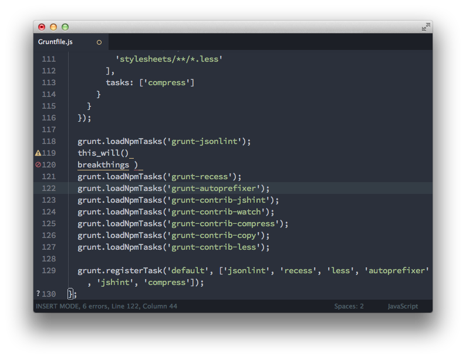

# Minima

### A Gutter Icon Theme for [SublimeLinter](https://github.com/SublimeLinter/SublimeLinter)



## Installation

1. Download this repo as a zip file.
2. Extract `SublimeLinter - Minima Theme` to your `Packages/User` directory.
3. Restart Sublime.
4. Go to `Tools > SublimeLinter > Choose Gutter Theme...` and select `Minima` from the list.
5. Enjoy!

## Further Configuration

I'm loving the [Spacegray](http://kkga.github.io/spacegray/) theme by @kkga right now, so here's some additional color settings to get these icons to match.

In your `SublimeLinter.sublime-settings` file (located under your `Packages/User` directory), update `"error_color""` and `"warning_color"` like so:

``` json
{
	"error_color": "af5c65",
	"warning_color": "d7bb82"
}
```

That's it! Things should match and look like the demo screenshot now.

## Customization

This theme uses icons from [Font Awesome](http://fortawesome.github.io/Font-Awesome/), and I've provided the PSD I exported the icons from. If you're not a fan of the icons I've used, change them! Install Font Awesome locally and use the [Font Awesome Cheatsheet](http://fortawesome.github.io/Font-Awesome/cheatsheet/) to copy/paste the desired icons right into Photoshop. Simple!
